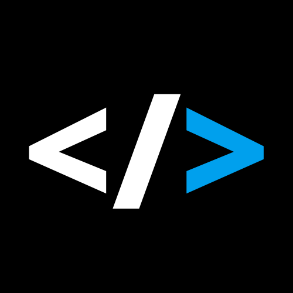

<p align="center">
  

<h1 align="center">
    
</h1>

<br>

## 🧪 Tecnologias

Esse projeto foi desenvolvido com as seguintes tecnologias:

- [React](https://reactjs.org)
- [Material-UI](https://mui.com/pt/)

## 🚀 Como executar

Clone o projeto e acesse a pasta do mesmo.

```bash
$ git clone https://github.com/gabrielgws/netflix-clone
$ cd netflix-clone
```

Para iniciá-lo, siga os passos abaixo:
```bash
# Instalar as dependências
$ yarn

# Iniciar o projeto
$ yarn start
```
O app estará disponível no seu browser pelo endereço http://localhost:3000.

## 💻 Projeto

Este é um projeto desenvolvido durante a live **[Bonieky Lacerda](https://www.youtube.com/watch?v=tBweoUiMsDg&t=8756s)**.

## 🔖 Layout

Direitos de imagem para Netflix <br/>
Dados pegos do site Themoviedb.org

## 📝 License

---

Feito com 💜 by gabrielgws :rocket:	
